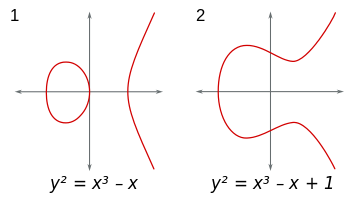

# Contract, Immutability & Composability, Address, Gas, Finality in PoW/PoS

<br />

1. Contract, Immutability & Composability
2. Account, Balance in wei, Address, ECDSA, Key Generation
3. Gas fee in gwei, Why needed
4. Finality: in PoW, in PoS
5. JSON-RPC API
6. Transaction
7. Receipt

<br />

## 1. Contract, Immutability & Composability

### 1-1. Contract

(Smart) Contract는 간단히 말해서 [Ethereum 블록체인](https://ethereum.org/en/developers/docs/intro-to-ethereum/)에 배포된 프로그램으로, [DApp](https://ethereum.org/en/developers/docs/dapps/)의 백엔드로 볼 수 있습니다. 모든 Contract는 Ethereum 상에서 주소(Address)를 갖는데, 이는 Contract가 Ethereum 블록체인에 존재하는 계정(Account)의 한 종류이기 때문입니다. 이때문에 Contract는 보유하고있는 [Ether](https://ethereum.org/en/developers/docs/intro-to-ether/) Balance를 갖고, 블록체인 상에서 Ether를 주고받는 Transaction을 수행할 수 있는 것입니다. 마치 블록체인 지갑에서 볼 수 있는 주소처럼 Contract도 자신의 Ether Balance를 갖는 주소를 갖습니다!

> A "smart contract" is simply a program that runs on the Ethereum blockchain. It's a collection of code (its functions) and data (its state) that resides at a specific address on the Ethereum blockchain. Smart contracts are a type of Ethereum account. - [INTRODUCTION TO SMART CONTRACTS | Ethereum](https://ethereum.org/en/developers/docs/smart-contracts/)

<br />

### 1-2. Immutability

Contract는 불변성, Immutability이라는 특성을 갖는데, 이는 블록체인이 불변성을 갖기 때문입니다. Ethereum에 Contract를 배포하면 블록체인의 특성상 이 Contract는 더이상 수정과 삭제가 불가능하고 수많은 노드들에 의해 영원히 존재하게 되죠. 이 불변성이 Contract를 함부로 건드릴 수 없도록 하기 때문에 보안을 높여주기도하지만, Contract의 문제가 발견되었을 때 그 내용을 수정하기 어렵게 만들기도 합니다! Contract를 개발하는 관점에서는, Contract의 특정 부분을 수정할 수 있도록 하기 위해 Contract Owner에 한해 데이터를 Write할 수 있게 Contract를 짤 수 있습니다. 이 부분은 다른 섹션에서 별도로 정리를 할 예정인데, 여기에서는 Immutability의 이점은 유지하되 Contract의 변경 가능성을 열어두는 방법이 존재한다 정도로 정리하겠습니다. 

문제는, Contract를 누군가가 임의로 수정할 수 있다는 것만으로 탈중앙을 해칠 수 있다는 건데, 아무리 Contract를 만들고 배포한 Owner라고 하더라도 특별한 권한을 부여하는 것 자체가 중앙적 성격을 갖기 때문입니다. 탈중앙에서는 Owner를 포함하여 그 누구도 신뢰할 필요가 없기를 지향하고요! (Trustless)

> 이렇게 소유자가 컨트랙트에 특별한 권한을 갖도록 하는 것은 자주 필요하지만, 이게 악용될 수도 있다네. 예를 들어, 소유자가 다른 사람의 좀비를 뺏어올 수 있도록 하는 백도어 함수를 추가할 수도 있지! (..ABBR..) 그러니 잘 기억하게. 이더리움에서 돌아가는 DApp이라고 해서 그것만으로 분산화되어 있다고 할 수는 없네. 반드시 전체 소스 코드를 읽어보고, 자네가 잠재적으로 걱정할 만한, 소유자에 의한 특별한 제어가 불가능한 상태인지 확인하게. 개발자로서는 자네가 잠재적인 버그를 수정하고 DApp을 안정적으로 유지하도록 하는 것과, 사용자들이 그들의 데이터를 믿고 저장할 수 있는 소유자가 없는 플랫폼을 만드는 것 사이에서 균형을 잘 잡는 것이 중요하네. - CrytoZombies Course

<br />

### 1-3. Composability

Contract의 또다른 특징은 [Composability](https://ethereum.org/en/developers/docs/smart-contracts/composability/)인데, Ethereum 네트워크에 배포된 Contract들은 일종의 오픈 API처럼 어느 앱에서나 가져다 사용할 수 있습니다. Ethereum DEX의 선구자인 [Uniswap](https://app.uniswap.org/#/swap?chain=mainnet)의 토큰 스왑 Contract도 가져다 사용할 수 있죠! 여러 Contract를 모듈처럼 조합해서 앱을 완성할 수도 있습니다. 하지만 이 Composability로 인해 필연적으로 외부 의존성이 생기는데, 만약 내가 의존하는 Contract에 버그가 있다면 내 Contract, 혹은 앱도 그 버그를 고스란히 포함하게 됩니다.

프로그램 개발에 있어 모듈화는 어찌보면 당연하고, Contract Composability 역시 자연스럽게 생겨난 것처럼 보이지만, 어느정도는 Ethereum 개발자들이 의도적으로 가능하게 만든 것입니다. Ethereum 네트워크에는 서로 다른 토큰과 거버넌스를 가진 수많은 Contract가 존재하는데, [ERC-20](https://ethereum.org/ko/developers/docs/standards/tokens/erc-20/)과 같이 토큰 구현에 대한 표준을 마련함으로써, Contract에서 이 표준을 지키는 토큰이라면 언제든 상호작용이 가능하도록 했기 때문입니다. ERC-20은 [FT](https://en.wikipedia.org/wiki/Fungible), ERC-721은 [NFT](https://en.wikipedia.org/wiki/Non-fungible_token) 표준안이고, ERC-1155는 FT, NFT 뿐만 아니라 다양한 토큰을 포함하는 개선된 표준안입니다.

> With these token standards in place, smart contracts can act as building blocks that are able to be assembled into larger systems. Just like a software library, smart contracts for different protocols and applications can easily plug into each other like Lego pieces. - [Composability is Innovation - Linda Xie](https://future.a16z.com/how-composability-unlocks-crypto-and-everything-else/)

<br />

## 2. Account, Balance in wei, Address, ECDSA, Key Generation

### 2-1. 2 Types of Account

두 종류의 [계정(Account)](https://ethereum.org/en/developers/docs/accounts/)이 있고, 모든 계정은 Ether를 주고받거나 홀드할 수 있으며, Contract와 상호작용할 수 있습니다.

- Externally-owned Account(EOA): Private Key를 통해 접근할 수 있는 계정, 계정의 소유자에 의해 Transaction을 시작할 수 있음
- Contract Account(CA): 블록체인 네트워크에 배포된 프로그램

<br />

Go로 작성된 [Ethereum 코드](https://github.com/ethereum/go-ethereum/blob/master/accounts/accounts.go)를 확인해보면, 계정은 다음과 같이 `struct` 타입으로 정의되어 있습니다.

```go
// accounts/accounts.go

// Account represents an Ethereum account located at a specific location defined
// by the optional URL field.
type Account struct {
	Address common.Address `json:"address"` // Ethereum account address derived from the key
	URL     URL            `json:"url"`     // Optional resource locator within a backend
}
```

<br />

계정의 고유한 주소값인 `Address` 필드는 20bytes 고정 배열인데, 이는 [`types.go`](https://github.com/ethereum/go-ethereum/blob/da16d089c09dfbe5497862496c6f34d32ba6bd0e/common/types.go#L201) 파일에서 확인할 수 있습니다.

```go
// types.go

const (
	// ...

	// AddressLength is the expected length of the address
	AddressLength = 20
)

// ...

type Address [AddressLength]byte
```

<br />

계정의 상태는 다음과 같이 4개의 필드로 이루어져있습니다.

```go
// core/types/state_account.go

// StateAccount is the Ethereum consensus representation of accounts.
// These objects are stored in the main account trie.
type StateAccount struct {
	Nonce    uint64
	Balance  *big.Int
	Root     common.Hash // merkle root of the storage trie
	CodeHash []byte
}
```

- `Nonce`: 계정이 만들어낸 Transaction의 수, Contract 계정의 경우 해당 계정이 만든 Contract의 수를 나타내는데, 이는 Contract를 배포하는 것 자체가 Transaction이기 때문

- `Balance`: 계정이 소유하는 Ether 잔액 ([wei](#user-content-2-2-balance-in-wei))

- `CodeHash`: Contract byte 코드의 Hash 값으로 이 Hash를 사용해서 코드를 찾을 수 있음, Externally-owned 계정의 `codeHash`는 빈 String의 Hash 값

- `Root`: 계정의 상태 정보가 저장될 Storage 트리의 루트 노드를 256bits 값으로 Hashing한 값

<br />


사진출처: [Accounts | Ethereum](https://ethereum.org/en/developers/docs/accounts/)

<br />

### 2-2. Balance in wei

`balance` 표시와 bit 연산시에는 wei를 사용하는데, 1 wei = 0.000000000000000001 ETH 입니다. wei를 사용하는 이유는 전통적인 부동소수점 처리방식을 블록체인에서 그대로 사용하면 약속된 표현범위를 벗어나는 만큼의 ETH 금액이 증발해버리기 때문입니다! Ether의 토큰 소수점 자릿수는 18자리인데, 따라서 가장 작은 Ether 단위인 0.000000000000000001 ETH → 1 wei로 매핑하여 컴퓨터가 bit 연산을 할 때 Balance에 대해 정수 연산을 할 수 있게 했습니다. [부동 소수점(Floating Point)란 무엇인가? - modolee](https://steemit.com/kr/@modolee/floating-point) 블로그 글의 설명이 도움이 되었습니다.

<br />

### 2-3. Address

모든 이더리움의 계정은 개인 키(Private Key)와 공개 키(Public Key)의 쌍으로 정의되는데, 개인 키를 비대칭 암호화해서 공개 키를 생성하기 때문에 이 두 키를 비대칭 키(Asymmetric Key)라고 부릅니다. 개인 키로는 공개 키를 얻어낼 수 있지만, 공개 키로는 개인 키를 알 수 없기 때문에 "비대칭" 암호화라고 말합니다. 이더리움에서는 비대칭 암호화 알고리즘으로 비트코인의 [타원곡선 디지털 서명 알고리즘(ECDSA, Elliptic Curve Digital Signature Algorithm)](https://en.wikipedia.org/wiki/Elliptic_Curve_Digital_Signature_Algorithm) 라이브러리인 [`secp256k1`](https://github.com/bitcoin-core/secp256k1/blob/master/src/secp256k1.c)을 사용하는데, 비트코인의 라이브러리는 C언어로 작성되어있기 때문에 Go로 래핑하여 사용합니다.

- Externally-owned Account: 임의의 개인 키를 ECDSA에 통과시켜 공개 키를 생성하고, 이 공개 키를 Keccak256 Hash 함수에 통과시켜 32bytes 값을 얻어낸 후 마지막 20bytes를 절삭하여 계정 주소로 사용함, 개인 키는 길이가 64인 Hex 문자열로 보통 라이브러리를 사용하여 랜덤 생성함
- Contract Account: Contract 배포자의 주소와 `nonce` 값으로 주소가 만들어짐

<br />

### 2-4. ECDSA

ECDSA를 일반적인 [AES](https://en.wikipedia.org/wiki/Advanced_Encryption_Standard) 암호화와 혼동해서는 안됩니다. 보통 어떤 데이터를 암호화했다고하면 그 내용을 알 수 없도록 Encrypt 하는 것을 말하지만, ECDSA는 데이터를 숨기는 것이 아니라 해당 데이터가 외부의 간섭을 받지 않았다는 사실을 보장하는 역할을 하는 알고리즘입니다. 이더리움에서는 어떤 Transaction이 다른 누구도 아닌 해당 계정의 소유자에 의해 만들어졌음을 보장하기 위해 Transaction을 전송할 때 개인 키를 사용해서 디지털 서명을 하는데, 이 디지털 서명을 검증할 때는 개인 키가 아닌 공개 키가 사용됩니다. 개인 키는 비밀이라 접근할 수 없으니까요! 이때 사용되는 공개 키를 처음 생성할 때 ECDSA가 사용되며, 디지털 서명을 생성할 때도 ECDSA가 사용됩니다.

> You shouldn't confuse ECDSA with AES (Advanced Encryption Standard) which is to encrypt the data. ECDSA does not encrypt or prevent someone from seeing or accessing your data, what it protects against though is making sure that the data was not tampered with. - [Understanding How ECDSA Protects Your Data](https://www.instructables.com/Understanding-how-ECDSA-protects-your-data/#step1)

<br />

디지털 서명을 검증하는 방식을 간단히 설명하면 이렇습니다.

- 개인 키를 생성한다. 개인 키는 자신 외에 그 누구도 알 수 없는 비밀 키이다
- ECDSA 곡선 그래프를 이루는 방정식에 개인 키를 대입해서 공개 키를 생성한다
- 공개 키를 역추적해서 개인 키를 알 수 있는 방법은 없다
- 이제 이 공개 키를 사용해서 누구나 내가 만든 디지털 서명이 유효한지 검사할 수 있다
- 디지털 서명은 Transaction을 전송할 때마다 만드는데, 개인 키와 데이터 파일의 Hash 값을 사용해서 디지털 서명을 생성한다
- 디지털 서명을 만들 때도 ECDSA가 사용된다
- 이 디지털 서명은 비밀 키를 사용해서 만들지만, 누구나 공개 키만을 사용해서 이 디지털 서명이 유효한지 검사할 수 있다
- 다시 말해, 개인 키 소유자가 아니면 개인 키를 알지 못하기 때문에 그 누구도 서명을 위조할 수는 없지만, 누구나 공개 키를 사용해서 해당 서명이 유효한지 확인할 수는 있다
- 개인 키를 알 수 없는데, 어떻게 서명을 검증할 수 있을까?
- 개인 키를 사용해서 만든 디지털 서명은 두 개의 파트 R과 S로 이루어진다
- 공개 키와 S를 마법 방정식에 넣었을 때 그 결과가 R과 같으면 해당 서명은 유효하다
- 이는 수학적으로 증명되었기 때문이다

<br />

ECDSA는 디지털 서명을 만들 때 160bits Hash(Message Digest)를 생성하는 [SHA1 Hash 알고리즘](https://en.wikipedia.org/wiki/SHA-1)을 사용합니다. SHA1은 데이터 Encrypt 관점에서는 Deprecated 되었지만, 데이터가 변경되지 않았음을 식별하는데는 여전히 사용됩니다.

> Revision control systems such as Git, Mercurial, and Monotone use SHA-1, not for security, but to identify revisions and to ensure that the data has not changed due to accidental corruption. Linus Torvalds said about Git - [SHA-1 | Wikipedia](https://en.wikipedia.org/wiki/SHA-1)

<br />

디지털 서명은 해당 Transaction 정보를 담고있는 텍스트 데이터를 Hashing한 값과 개인 키 등을 조합해서 만든다는 것을 짚고 넘어가겠습니다. 컴퓨터에서 하나의 텍스트 파일은 최종적으로 연속된 byte(= 8bits)의 집합으로 해석되는데, 각각의 byte는 0 ~ 255 사이의 십진수 숫자로 나타낼 수 있습니다. 8bits가 256(2⁸)가지 수를 나타낼 수 있기 때문이죠. 이 byte 덩어리들은 코드상에서는 [Hex](https://en.wikipedia.org/wiki/Hexadecimal) 값으로 계산됩니다. SHA1 Hash 알고리즘은 데이터 파일을 Hashing할 때 각 byte가 나타내는 Hex 값들을 모두 더한 후 매우 복잡한 Modulus를 사용하여 160bits 고정 길이의 최종 Hex 값을 반환합니다.

<br />

#### Point Addition

이제 ECDSA의 수학적 배경을 살펴보겠습니다. ECDSA는 다음 방정식에 기반합니다:_`𝘺² = (𝘹³ + 𝘈𝘹 + 𝘉) 𝗆𝗈𝖽 𝘗`_

방정식에서 `𝘺²`은 어떤 값을 `𝘱`로 나눈 나머지 값이므로, 항상 `𝘱` 보다 작다는 것을 알 수 있고요, ECDSA에서는 정수만 사용하기 때문에 `𝘺`는 `0` 이상 `√𝘱` 미만의 값 중 정수로 떨어지는 어떤 값임을 알 수 있습니다. 자, 여기에서 사용된 ECDSA의 두 가지 기본 사항을 기억해야 합니다.

- 정수만 사용: ECDSA가 기반하는 방정식의 변수들에 대입 가능한 값은 특정 범위 내의 정수로 제한되는 것이 특징인데, 해당 범위는 공개 키나 디지털 서명을 만들 때 몇 bit를 사용할 것인지에 따라 결정됨
- Modulus(나머지 연산): 방정식에서 Modulus를 사용하기 때문에 `𝘺`는 항상 고정 범위 내의 값임

<br />

Modulus를 제거한 `𝘺² = 𝘹³ + 𝘈𝘹 + 𝘉` 방정식의 그래프는 아래와 같은 형태들로 그려지고요,



<br />

아래에서 그래프 곡선 상의 몇몇 지점들이 특별한 상관관계를 갖는 것을 확인할 수 있습니다.


<br />

여기에서 [Point Addition](https://en.wikipedia.org/wiki/Elliptic_curve_point_multiplication#Point_addition) 개념을 확인할 수 있습니다. 가령 가장 왼쪽 그림에서, 왼쪽 타원 부분의 `P`와 `Q`를 이어서 만든 선이 오른쪽 곡선과 교차하는 지점 `R`을 구할 수 있는데, `P + Q + R = 0`을 만족하는 `P`, `Q`, `R`의 값을 키 생성이나 디지털 서명에 사용하여 개인 키를 역추적할 필요없이 해당 방정식이 성립하는 것을 검증할 수 있다는 아이디어입니다.

<br />

ECDSA 방식을 완전히 이해하려면 수학적으로 더 깊게 들어가야하지만, 곡선상에 위치한 몇몇 정수 지점들의 특별한 상관 관계를 사용해서 개인 키를 알 필요없이 디지털 서명을 검증하는구나 라고 간단히 정리해볼 수 있겠습니다. [Addition on Elliptic Curves](https://codegolf.stackexchange.com/questions/75786/addition-on-elliptic-curves)에서 `P`, `Q` 값을 수학적으로 구하는 방법을 더 알아보실 수 있고, [Understanding How ECDSA Protects Your Data](https://www.instructables.com/Understanding-how-ECDSA-protects-your-data/)에서 ECDSA를 더 자세하게 공부하실 수 있습니다.

<br />

### 2-5. Key Generation

Ethereum의 [`accounts/keystore`](https://github.com/ethereum/go-ethereum/blob/da16d089c09dfbe5497862496c6f34d32ba6bd0e/accounts/keystore/keystore.go) 패키지는 계정 키가 저장되는 디렉토리를 관리하는 패키지입니다. `NewAccount(passphrase)` 함수 구현 부분을 보면, 키 생성에 사용할 임의의 문자열 `passphrase`를 파라미터로 받은 후 `storeNewKey(storage, reader, passphrase)` 함수를 호출할 때 넘겨줍니다. `storeNewKey` 함수는 개인 키를 생성한 후, 이 키 값에 기반한 공개 키와 계정 `struct`까지 모두 생성하여 `key, account, err`를 반환합니다.

```go
// accounts/keystore/keystore.go

// NewAccount generates a new key and stores it into the key directory,
// encrypting it with the passphrase.
func (ks *KeyStore) NewAccount(passphrase string) (accounts.Account, error) {
	_, account, err := storeNewKey(ks.storage, crand.Reader, passphrase)
	if err != nil {
		return accounts.Account{}, err
	}
	// Add the account to the cache immediately rather
	// than waiting for file system notifications to pick it up.
	ks.cache.add(account)
	ks.refreshWallets()
	return account, nil
}
```

<br />

다음은 `storeNewKey` 함수의 구현부인데, 내부적으로 `newKey(rand)` 함수를 호출하고 있는 것을 확인할 수 있습니다. `newKey` 함수는 실질적인 키 생성 과정을 담고있는데, 이 함수 내에서 개인 키를 생성하고, ECDSA에 통과시켜 공개 키를 생성하고, 공개 키를 다시 Hashing한 후 최종 20bytes를 절삭하여 계정의 주소값을 만들어내는 일련의 과정이 모두 여기에서 일어납니다.

```go
// accounts/keystore/key.go

func storeNewKey(ks keyStore, rand io.Reader, auth string) (*Key, accounts.Account, error) {
    // Key 구조체의 포인터 반환
	key, err := newKey(rand)
	if err != nil {
		return nil, accounts.Account{}, err
	}

	a := accounts.Account{
		Address: key.Address,
		URL:     accounts.URL{Scheme: KeyStoreScheme, Path: ks.JoinPath(keyFileName(key.Address))},
	}
	if err := ks.StoreKey(a.URL.Path, key, auth); err != nil {
		zeroKey(key.PrivateKey)
		return nil, a, err
	}
	return key, a, err
}
```

<br />

`newKey(rand)` 함수는 Go의 기본 라이브러리인 [`crypto/ecdsa`](https://pkg.go.dev/crypto/ecdsa) 패키지의 함수를 사용해서 개인 키와 공개 키를 생성하고, 생성한 키 정보들과 계정 주소를 `Key` `struct`에 담아 포인터를 반환합니다. 코드는 [`accounts/keystore/key.go`](https://github.com/ethereum/go-ethereum/blob/da16d089c09dfbe5497862496c6f34d32ba6bd0e/accounts/keystore/key.go#L133)에서 확인할 수 있습니다.

```go
// accounts/keystore/key.go

func newKey(rand io.Reader) (*Key, error) {
	privateKeyECDSA, err := ecdsa.GenerateKey(crypto.S256(), rand) // ECDSA를 사용해서 개인 키 생성
	if err != nil {
		return nil, err
	}
	return newKeyFromECDSA(privateKeyECDSA), nil
}
```

```go
// accounts/keystore/key.go

func newKeyFromECDSA(privateKeyECDSA *ecdsa.PrivateKey) *Key {
	id, err := uuid.NewRandom()
	if err != nil {
		panic(fmt.Sprintf("Could not create random uuid: %v", err))
	}
	key := &Key{
		Id:         id,
		Address:    crypto.PubkeyToAddress(privateKeyECDSA.PublicKey),
		PrivateKey: privateKeyECDSA,
	}
	return key
}
```

<br />

## 3. Gas fee in gwei, Why needed

### 3-1. Gas

[Gas](https://ethereum.org/en/developers/docs/gas/)는 Contract의 런타임인 [EVM](https://ethereum.org/en/developers/docs/evm/)에서 Transaction을 처리할 때 소모되는 컴퓨팅 파워를 나타내는 단위입니다. [OPCODES FOR THE EVM](https://ethereum.org/en/developers/docs/evm/opcodes) 공식문서에서 연산별로 소모되는 Gas가 어느정도인지 확인할 수 있었습니다! 아무튼, 어떤 사람이 Transaction을 진행하려면 요구되는 연산량만큼의 수수료를 지불해야하는데, 이를 Gas비라고 하지요. [Etherscan](https://etherscan.io/gastracker)에서는 실시간 Gas비 추적과, Gas비에 따른 Transaction 처리 속도 예측을 제공합니다.

<br />


사진출처: [GAS AND FEES | Ethereum](https://ethereum.org/en/developers/docs/gas/)

<br />

### 3-2. Gas fee in gwei

Gas비는 다음과 같이 구성되고, 참고로 Gas비 계산에는 gwei(giga-wei)가 사용되는데, 1 gwei = 1000000000 wei = 0.000000001 ETH (10⁻⁹ ETH)입니다.

- `baseFeePerGas`: Contract 로직을 처리하기 위해 필요한 연산의 수(Gas)만큼 소각되는 Ether, 네트워크 수요에 따라 기본 Fee에 변동이 있음 (이전 블록의 사이즈가 다음 블록 Gas에 대한 Fee를 결정)
- `maxPriorityFeePerGas`: Transaction Validator에게 팁으로 지불할 Gas당 Ether, 내 요청을 우선적으로 처리해주는 것에 대한 팁

> This means if the block size is greater than the target block size, the protocol will increase the base fee for the following block. Similarly, the protocol will decrease the base fee if the block size is less than the target block size. The amount by which the base fee is adjusted is proportional to how far the current block size is from the target. - [GAS AND FEES | Ethereum](https://ethereum.org/en/developers/docs/gas/)

<br />

보통 Ether를 전송하기만 하는 단순한 Transaction에는 21000 Gas가 소모되는데요, 만약 1 ETH를 전송하는데 `baseFeePerGas`가 190 gwei이고, `maxPriorityFeePerGas`로 10 gwei를 지불하겠다고 하면, 다음과 같이 총 Gas비를 계산할 수 있습니다: _(190 + 10) * 21000 = 4,200,000 gwei = 0.0042 ETH_. 따라서 1 ETH를 전송하려면 실제로는 총 1.0042 ETH를 사용해야 합니다.

<br />

만약 Solidity로 작성된 Contract에서 어떤 함수가 `external`과 `view` Modifier를 갖고 있다면, 해당 Contract 외부에서 어떤 데이터를 단순히 조회만 하는 것이므로 Gas를 소모하지 않습니다! 따라서 Solidity로 Contract를 작성할 때 가능한 모든 함수에 `external view`를 붙이는 것이 Gas비 최적화의 기본이라고 할 수 있습니다.

> 함수를 실행하는 데에 얼마나 많은 가스가 필요한지는 그 함수의 로직(논리 구조)이 얼마나 복잡한지에 따라 달라지네. 각각의 연산은 소모되는 가스 비용(gas cost)이 있고, 그 연산을 수행하는 데에 소모되는 컴퓨팅 자원의 양이 이 비용을 결정하네. 예를 들어, storage에 값을 쓰는 것은 두 개의 정수를 더하는 것보다 훨씬 비용이 높네. 자네 함수의 전체 가스 비용은 그 함수를 구성하는 개별 연산들의 가스 비용을 모두 합친 것과 같네.
> view 함수는 사용자에 의해 외부에서 호출되었을 때 가스를 전혀 소모하지 않네. ... 사용자들을 위해 DApp의 가스 사용을 최적화하는 비결은 가능한 모든 곳에 읽기 전용의 external view 함수를 쓰는 것이라는 것만 명심해두게.
> 참고: 만약 view 함수가 동일 컨트랙트 내에 있는, view 함수가 아닌 다른 함수에서 내부적으로 호출될 경우, 여전히 가스를 소모할 것이네. 이것은 다른 함수가 이더리움에 트랜잭션을 생성하고, 이는 모든 개별 노드에서 검증되어야 하기 때문이네. 그러니 view 함수는 외부에서 호출됐을 때에만 무료라네. - CryptoZombies Course

<br />

### 3-3. Why needed

Gas 비용은 Ethereum 네트워크를 보호하기 위해 고안된 방법인데, 불필요하고 무거운 연산을 요청하는 등의 방식으로 네트워크 운영을 방해하지 못하도록 요청하는 연산량만큼의 비용을 지불하도록 설계한 것입니다.

> In short, gas fees help keep the Ethereum network secure. By requiring a fee for every computation executed on the network, we prevent bad actors from spamming the network. In order to avoid accidental or hostile infinite loops or other computational wastage in code, each transaction is required to set a limit to how many computational steps of code execution it can use. The fundamental unit of computation is "gas". - [GAS AND FEES | Ethereum](https://ethereum.org/en/developers/docs/gas/)

<br />

> 이더리움을 만든 사람들은 누군가가 무한 반복문을 써서 네트워크를 방해하거나, 자원 소모가 큰 연산을 써서 네트워크 자원을 모두 사용하지 못하도록 만들길 원했다네. 그래서 그들은 연산 처리에 비용이 들도록 만들었고, 사용자들은 저장 공간 뿐만 아니라 연산 사용 시간에 따라서도 비용을 지불해야 한다네. - CryptoZombies Course

<br />

## 4. Finality: in PoW, in PoS

### 4-1. in PoW

기본적으로 블록에 포함된 Transaciton은 더 이상 변경할 수 없기 때문에 Finality를 가진다고 봅니다. 하지만 Transaction이 완료되더라도 진짜 Finality를 가지게 되었는지 확신하기 위해서는, 최소한 대략 1분 이상의 시간을 두고 기다려야 합니다. 현재 Ethereum의 합의 메커니즘은 [채굴](https://ethereum.org/en/developers/docs/consensus-mechanisms/pow/mining/)을 통한 [PoW](https://ethereum.org/en/developers/docs/consensus-mechanisms/pow/)와 [Longest Chain Rule](https://ethereum.org/en/developers/docs/consensus-mechanisms/#sybil-chain)에 기반하는데, 문제는 둘 이상의 채굴자가 동시에 블록 생성에 성공하는 아주 드문 경우에 발생합니다. 두 블록이 동시에 생성되면 Temporary Fork가 만들어지고, 이 때문에 둘 중 하나의 Fork가 Finality를 인정받기까지 최소 6 개의 블록이 추가로 더해질 때까지 (약 1분 이상) Transaction을 확신하지 않고 기다리는 것이 권장됩니다. 따라서 Finality를 확신하기까지 시간이 소요됨을 인지하고 UX 설계시 이를 고려해야 합니다!

> Because miners work in a decentralized way, two valid blocks can get mined at the same time. This creates a temporary fork. Eventually, one of these chains will become the accepted chain after a subsequent block has been mined and added, making it longer. (..ABBR..) But to complicate things further, transactions rejected on the temporary fork may have been included in the accepted chain. This means it could get reversed. So finality refers to the time you should wait before considering a transaction irreversible. For Ethereum, the recommended time is six blocks or just over 1 minute. After six blocks, you can say with relative confidence that the transaction was successful. You can wait longer for even greater assurances. - [FINALITY | Ethereum](https://ethereum.org/en/developers/docs/consensus-mechanisms/pow/#finality)

<br />

### 4-2 in PoS

[PoS](https://ethereum.org/en/developers/docs/consensus-mechanisms/pos/) 기반의 새로 도입될 합의 메커니즘에서는 Finality를 확신하기 더욱 쉬워집니다. 왜냐하면 블록을 생성하는 Validator가 채굴 경쟁에 의해 결정되지 않고, 알고리즘에 의해 랜덤하게 결정되기 때문입니다. 따라서 두 개의 블록이 동시에 생성될 가능성이 사라지고요, 생성된 블록에 대해서는 전체 Validator의 2/3가 동의하면 해당 블록은 Finality를 갖게 됩니다! 더 정확하게는, 하나의 [Shard](https://ethereum.org/en/upgrades/shard-chains/) 블록당 최소 128 개 노드로 구성된 Validator Committee가 해당 블록 조각을 검증해줘야하고요, 32 개의 블록이 만들어질 때마다 Validator Committee가 랜덤으로 재구성되기 때문에 Ethereum을 더 안전하게 해준다는 아이디어입니다.

특히 합의에 참여하는 Validator들이 각자가 스테이킹한 소중한 Ether를 담보로 행동하기 때문에 나쁜 행동을 할 유인이 거의 없다고 보고 있는데, 나쁜 행동을 들키면 스테이킹 상태의 Ether를 모두 잃게될 뿐만 아니라, 네트워크에 나쁜 일이 일어나서 Ether의 가치가 폭락한다면 스테이킹으로 묶여있는 그들의 Ether 자산 가치도 떨어지기 때문입니다. 참고로 32 ETH를 스테이킹하면 Validator로 참여할 수 있고요, 더 적은 ETH를 사용하려면 스테이킹 Pool에 참여할 수 있습니다.

<br />

## 5. JSON-RPC API

DApp에서 Ethereum 블록체인 상의 데이터를 읽거나, Transaction을 처리하려면 Ethereum 노드에 연결해야 합니다. Ethereum 노드라는 것은 [Ethereum Client](https://ethereum.org/en/developers/docs/nodes-and-clients/#execution-clients)를 실행중인 컴퓨터인데, Ethereum의 구현제인 Ethereum Client를 실행하는 노드들이 모여 분산된 Ethereum 블록체인을 구성하는 것이죠. 모든 Ethereum Client는 [JSON-RPC](https://ethereum.org/en/developers/docs/apis/json-rpc/) 명세를 따르는 엔드포인트 구현체를 갖고있는데, 이를 통해 외부에서 Ethereum Client를 실행하고 있는 Ethereum 노드들에 연결할 수 있습니다. 웹 프론트엔드에서 Ethereum 노드에 직접 연결할 때는 보통 JavaScript 라이브러리를 사용하는데 [`ethers`](https://docs.ethers.io/v5/), [`web3`](https://web3js.readthedocs.io/en/v1.7.0/)가 대표적입니다. 이 라이브러리들은 지갑 생성, 토큰 전송, 서명 등 기본적인 거의 모든 기능을 지원하고요, [ABI](https://docs.soliditylang.org/en/v0.5.3/abi-spec.html) 포맷의 컴파일 된 Contract를 읽는 방식으로 Contract 함수를 직접 호출할 수도 있습니다.

<br />

## 6. Transaction

이더리움에서 Transaction은 한 계정에서 다른 계정으로 Ether를 전송하거나, Contract의 특정 함수를 호출할 때 발생합니다. 모든 Transaction은 디지털 서명을 통해 암호화되는데, 디지털 서명은 Transaction 정보를 담은 데이터 `struct`와 개인 키 등으로 만들어지고, ECDSA를 사용하여 암호화됩니다. [`core/types/transaction.go`](https://github.com/ethereum/go-ethereum/blob/da16d089c09dfbe5497862496c6f34d32ba6bd0e/core/types/transaction.go)에서 다음과 같이 `Transaction` `struct`를 확인할 수 있고요, `hash` 필드가 해당 Transaction을 Hashing한 값에 해당합니다.

```go
// core/types/transaction.go

// Transaction is an Ethereum transaction.
type Transaction struct {
	inner TxData    // Consensus contents of a transaction
	time  time.Time // Time first seen locally (spam avoidance)

	// caches
	hash atomic.Value
	size atomic.Value
	from atomic.Value
}
```

<br />

`TxData` 타입의 `inner` 필드는 Gas비를 비롯한 Transaction 정보를 담는 용도인데, 다음과 같이 `interface`로 정의되어 있고, 함수를 호출해서 값을 반환받도록 되어있습니다.

```go
// TxData is the underlying data of a transaction.
//
// This is implemented by DynamicFeeTx, LegacyTx and AccessListTx.
type TxData interface {
	txType() byte // returns the type ID
	copy() TxData // creates a deep copy and initializes all fields

	chainID() *big.Int
	accessList() AccessList
	data() []byte
	gas() uint64
	gasPrice() *big.Int
	gasTipCap() *big.Int
	gasFeeCap() *big.Int
	value() *big.Int
	nonce() uint64
	to() *common.Address

	rawSignatureValues() (v, r, s *big.Int) // v, r, s → ECDSA 디지털 서명을 만들 때 사용되는 값들
	setSignatureValues(chainID, v, r, s *big.Int)
}
```

<br />

이 `interface`를 구현한 패키지 중 하나인 [`dynamic_fee_tx.go`](https://github.com/ethereum/go-ethereum/blob/da16d089c09dfbe5497862496c6f34d32ba6bd0e/core/types/dynamic_fee_tx.go)를 보면, 다음과 같은 `struct`의 각 필드 값들을 반환하고 있음을 확인할 수 있습니다.

```go
// core/types/dynamic_fee_tx.go

type DynamicFeeTx struct {
	ChainID    *big.Int
	Nonce      uint64
	GasTipCap  *big.Int // a.k.a. maxPriorityFeePerGas
	GasFeeCap  *big.Int // a.k.a. maxFeePerGas
	Gas        uint64
	To         *common.Address `rlp:"nil"` // nil means contract creation
	Value      *big.Int
	Data       []byte
	AccessList AccessList

	// Signature values
	V *big.Int `json:"v" gencodec:"required"`
	R *big.Int `json:"r" gencodec:"required"`
	S *big.Int `json:"s" gencodec:"required"`
}
```

<br />

## 7. Receipt

이더리움은 모든 Transaction에 대한 로그를 `Receipt` `struct`를 사용해서 저장합니다. `Receipt`는 Transaction의 실행 과정에 대한 모든 기록을 저장하는데, 실행 환경과 검색을 위한 Indexing 등 블록 내에 정상적으로 저장된 Transaction에 대한 모든 정보들을 저장합니다. 각 필드는 다음 값들을 담는 용도입니다.

- `PostState`: Transaction 처리 후의 상태 정보
- `CumulativeGasUsed`: 해당 Transaction이 포함된 블록에서 사용한 누적 Gas 비용
- `Bloom`: `Logs`에 저장된 로그 정보들을 빠르게 검색하는데 사용하기 위한 블룸 필터
- `Logs`: Transaction 실행시 생성된 각종 로그들
- `TxHash`: 해당 Transaction의 주소
- `ContractAddress`: Contract에서 생성된 Transaction인 경우 해당 Contract 주소
- `GasUsed`: 해당 Transaction 실행에 사용된 Gas 비용 (하나의 Transaction을 처리하는데 기본으로 21,000 Gas가 기본으로 소요됨)

```go
// core/types/receipt.go

// Receipt represents the results of a transaction.
type Receipt struct {
	// Consensus fields: These fields are defined by the Yellow Paper
	Type              uint8  `json:"type,omitempty"`
	PostState         []byte `json:"root"`
	Status            uint64 `json:"status"`
	CumulativeGasUsed uint64 `json:"cumulativeGasUsed" gencodec:"required"`
	Bloom             Bloom  `json:"logsBloom"         gencodec:"required"`
	Logs              []*Log `json:"logs"              gencodec:"required"`

	// Implementation fields: These fields are added by geth when processing a transaction.
	// They are stored in the chain database.
	TxHash          common.Hash    `json:"transactionHash" gencodec:"required"`
	ContractAddress common.Address `json:"contractAddress"`
	GasUsed         uint64         `json:"gasUsed" gencodec:"required"`

	// Inclusion information: These fields provide information about the inclusion of the
	// transaction corresponding to this receipt.
	BlockHash        common.Hash `json:"blockHash,omitempty"`
	BlockNumber      *big.Int    `json:"blockNumber,omitempty"`
	TransactionIndex uint        `json:"transactionIndex"`
}
```

<br />

---

### References

- [Functional Topics | Ethereum](https://ethereum.org/en/developers/docs/intro-to-ethereum/)
- [Understanding How ECDSA Protects Your Data](https://www.instructables.com/Understanding-how-ECDSA-protects-your-data/)
- [코어 이더리움 프로그래밍](https://play.google.com/books/reader?id=WKLHDwAAQBAJ&pg=GBS.PA36&printsec=frontcover)