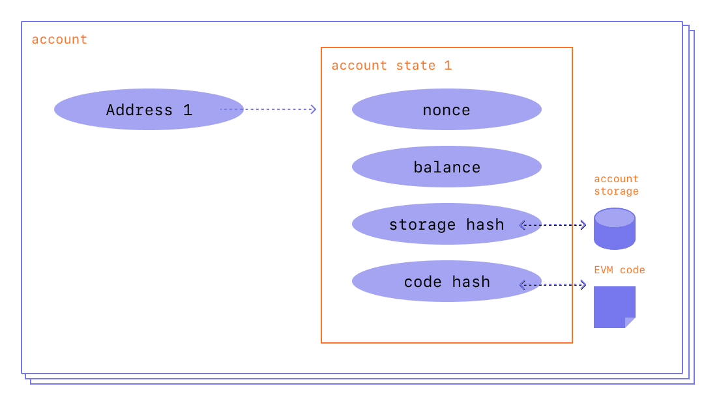

# Contract & Solidity

> This doc is WIP ...

<br />

1. Contract, Immutability & Composability
2. Access Control: `Ownable`
3. Account, Balance in wei, Address
4. Gas fee in gwei, Why needed
5. Storage is expensive
6. Uint
7. Time units
8. Modifier

<br />

## 1. Contract, Immutability & Composability

### 1-1. Contract

(Smart) Contract는 간단히 말해서 [Ethereum 블록체인](https://ethereum.org/en/developers/docs/intro-to-ethereum/)에 배포된 프로그램으로, [DApp](https://ethereum.org/en/developers/docs/dapps/)의 백엔드로 볼 수 있습니다. 모든 Contract는 Ethereum 상에서 주소(Address)를 갖는데, 이는 Contract가 Ethereum 블록체인에 존재하는 계정(Account)의 한 종류이기 때문입니다. 이때문에 Contract는 보유하고있는 [Ether](https://ethereum.org/en/developers/docs/intro-to-ether/) Balance를 갖고, 블록체인 상에서 Ether를 주고받는 Transaction을 수행할 수 있는 것입니다. 마치 블록체인 지갑에서 볼 수 있는 주소처럼 Contract도 자신의 Ether Balance를 갖는 주소를 갖습니다!

> A "smart contract" is simply a program that runs on the Ethereum blockchain. It's a collection of code (its functions) and data (its state) that resides at a specific address on the Ethereum blockchain. Smart contracts are a type of Ethereum account. - [INTRODUCTION TO SMART CONTRACTS | Ethereum](https://ethereum.org/en/developers/docs/smart-contracts/)

<br />

### 1-2. Immutability

Contract는 불변성, Immutability이라는 특성을 갖는데, 이는 블록체인이 불변성을 갖기 때문입니다. Ethereum에 Contract를 배포하면 블록체인의 특성상 이 Contract는 더이상 수정과 삭제가 불가능하고 수많은 노드들에 의해 영원히 존재하게 되죠. 이 불변성이 Contract를 함부로 건드릴 수 없도록 하기 때문에 보안을 높여주기도하지만, Contract의 문제가 발견되었을 때 그 내용을 수정하기 어렵게 만들기도 합니다! Contract를 개발하는 관점에서는, Contract의 특정 부분을 수정할 수 있도록 하기 위해 Contract Owner에 한해 데이터를 Write할 수 있게 Contract를 짤 수 있습니다. 이 부분은 다른 섹션에서 별도로 정리를 할 예정인데, 여기에서는 Immutability의 이점은 유지하되 Contract의 변경 가능성을 열어두는 방법이 존재한다 정도로 정리하겠습니다. 

문제는, Contract를 누군가가 임의로 수정할 수 있다는 것만으로 탈중앙을 해칠 수 있다는 건데, 아무리 Contract를 만들고 배포한 Owner라고 하더라도 특별한 권한을 부여하는 것 자체가 중앙적 성격을 갖기 때문입니다. 탈중앙에서는 Owner를 포함하여 그 누구도 신뢰할 필요가 없기를 지향하고요! (Trustless)

> 이렇게 소유자가 컨트랙트에 특별한 권한을 갖도록 하는 것은 자주 필요하지만, 이게 악용될 수도 있다네. 예를 들어, 소유자가 다른 사람의 좀비를 뺏어올 수 있도록 하는 백도어 함수를 추가할 수도 있지! (..ABBR..) 그러니 잘 기억하게. 이더리움에서 돌아가는 DApp이라고 해서 그것만으로 분산화되어 있다고 할 수는 없네. 반드시 전체 소스 코드를 읽어보고, 자네가 잠재적으로 걱정할 만한, 소유자에 의한 특별한 제어가 불가능한 상태인지 확인하게. 개발자로서는 자네가 잠재적인 버그를 수정하고 DApp을 안정적으로 유지하도록 하는 것과, 사용자들이 그들의 데이터를 믿고 저장할 수 있는 소유자가 없는 플랫폼을 만드는 것 사이에서 균형을 잘 잡는 것이 중요하네. - CrytoZombies Course

<br />

### 1-3. Composability

Contract의 또다른 특징은 [Composability](https://ethereum.org/en/developers/docs/smart-contracts/composability/)인데, Ethereum 네트워크에 배포된 Contract들은 일종의 오픈 API처럼 어느 앱에서나 가져다 사용할 수 있습니다. Ethereum DEX의 선구자인 [Uniswap](https://app.uniswap.org/#/swap?chain=mainnet)의 토큰 스왑 Contract도 가져다 사용할 수 있죠! 여러 Contract를 모듈처럼 조합해서 앱을 완성할 수도 있습니다. 하지만 이 Composability로 인해 필연적으로 외부 의존성이 생기는데, 만약 내가 의존하는 Contract에 버그가 있다면 내 Contract, 혹은 앱도 그 버그를 고스란히 포함하게 됩니다.

프로그램 개발에 있어 모듈화는 어찌보면 당연하고, Contract Composability 역시 자연스럽게 생겨난 것처럼 보이지만, 이는 Ethereum 개발자들이 의도적으로 가능하게 만든 것입니다. Ethereum 네트워크에는 서로 다른 토큰과 정책을 가진 수많은 Contract가 존재하는데, [ERC-20](https://ethereum.org/ko/developers/docs/standards/tokens/erc-20/)과 같이 Contract 내에서의 토큰 Transaction 방식에 대한 표준을 마련함으로써 이 표준을 지키는 Contract라면, 서로 다른 토큰을 사용하더라도 Contract간 상호작용이 가능하도록 했기 때문입니다. ERC-20은 [FT](https://en.wikipedia.org/wiki/Fungible), ERC-721은 [NFT](https://en.wikipedia.org/wiki/Non-fungible_token) 표준안이고, ERC-1155는 FT, NFT 뿐만 아니라 다양한 토큰을 포함하는 개선된 표준안입니다.

> With these token standards in place, smart contracts can act as building blocks that are able to be assembled into larger systems. Just like a software library, smart contracts for different protocols and applications can easily plug into each other like Lego pieces. - [Composability is Innovation - Linda Xie](https://future.a16z.com/how-composability-unlocks-crypto-and-everything-else/)

<br />

## 2. Access Control: `Ownable`

Contract를 개발할 때 중요한 포인트 중 하나는 Access Control 입니다. 데이터나 함수에 적절한 Access Control을 두지 않으면 누구나 Contract를 악용할 수 있기 때문입니다. Contract의 작동 방식을 바꿔버리거나 다른 사람의 자산을 훔칠 수도 있죠. [Open Zeppelin](https://openzeppelin.com/)은 검증된 Solidity 라이브러리들을 다수 제공하는데, 그 중 [`Ownable`](https://docs.openzeppelin.com/contracts/2.x/access-control#ownership-and-ownable)이라는 Contract는 Contract를 처음 배포하는 주소를 `owner`로 지정한 후 이 `owner`만이 특정 함수와 데이터에 접근하도록 제한할 수 있게 해줍니다. 다음과 같이 Import한 후 상속하면 됩니다! `Ownable` Contract의 `onlyOwner` Modifier를 사용하면 해당 함수는 `owner`만 호출할 수 있게 됩니다. `Ownable` 코드는 [여기](https://github.com/OpenZeppelin/openzeppelin-contracts/blob/master/contracts/access/Ownable.sol)에서 볼 수 있습니다.

```solidity
// SPDX-License-Identifier: MIT
pragma solidity ^0.8.11;

import "@openzeppelin/contracts/ownership/Ownable.sol";

contract MyContract is Ownable {
    function normalThing() public {
        // anyone can call this normalThing()
    }

    function specialThing() public onlyOwner {
        // only the owner can call specialThing()!
    }
}
```

<br />

## 3. Account, Balance in wei, Address

### 3-1. 2 Types of Account

두 종류의 [계정(Account)](https://ethereum.org/en/developers/docs/accounts/)이 있고, 모든 계정은 Ether를 주고받거나 홀드할 수 있으며, Contract와 상호작용할 수 있습니다.

- Externally-owned 계정: Private Key를 통해 접근할 수 있는 계정, 계정의 소유자에 의해 Transaction을 시작할 수 있음
- Contract 계정: 블록체인 네트워크에 배포된 프로그램

<br />

계정은 다음과 같이 4개의 필드로 이루어져있습니다.

- `nonce`: 계정이 만들어낸 Transaction의 수, Contract 계정의 경우 해당 계정이 만든 Contract의 수를 나타내는데, 이는 Contract를 배포하는 것 자체가 Transaction이기 때문

- `balance`: 계정이 소유하는 Ether 잔액

- `codeHash`: Contract 코드의 Hash 값으로 이 Hash를 사용해서 코드를 찾을 수 있음, Externally-owned 계정의 `codeHash`는 빈 String의 Hash 값

- `storageRoot`: 계정 저장소(Storage)에 저장되는 콘텐츠는 `mapping` 형태로 암호화되는데, 이때 Key의 256bit Hash 값

<br />



사진출처: [Accounts | Ethereum](https://ethereum.org/en/developers/docs/accounts/)

<br />

### 3-2. Balance in wei

`balance` 표시와 bit 연산시에는 wei를 사용하는데, 1 wei = 0.000000000000000001 ETH 입니다. wei를 사용하는 이유는 전통적인 부동소수점 처리방식을 블록체인에서 그대로 사용하면 약속된 표현범위를 벗어나는 만큼의 ETH 금액이 증발해버리기 때문입니다! Ether의 토큰 소수점 자릿수는 18자리인데, 따라서 가장 작은 Ether 단위인 0.000000000000000001 ETH → 1 wei로 매핑하여 컴퓨터가 bit 연산을 할 때 Balance에 대해 정수 연산을 할 수 있게 했습니다. [부동 소수점(Floating Point)란 무엇인가? - modolee](https://steemit.com/kr/@modolee/floating-point) 블로그 글의 설명이 도움이 되었습니다.

<br />

### 3-3. Address

계정 주소는 각각 다음에 따라 생성됩니다.

- Externally-owned 계정: Public Key의 256bit Hash 값의 마지막 20byte가 계정 주소로 사용됨 /  Public Key는 Private Key로부터 생성되고, Private Key는 길이가 64인 Hex 문자열로 보통 라이브러리를 사용하여 랜덤 생성함
- Contract 계정: Contract 배포자의 주소와 `nonce` 값으로 주소가 만들어짐

<br />

## 4. Gas fee in gwei, Why needed

### 4-1. Gas

[Gas](https://ethereum.org/en/developers/docs/gas/)는 Contract의 런타임인 [EVM](https://ethereum.org/en/developers/docs/evm/)에서 Transaction을 처리할 때 소모되는 컴퓨팅 파워를 나타내는 단위입니다. [OPCODES FOR THE EVM](https://ethereum.org/en/developers/docs/evm/opcodes) 공식문서에서 연산별로 소모되는 Gas가 어느정도인지 확인할 수 있었습니다! 아무튼, 어떤 사람이 Transaction을 진행하려면 요구되는 연산량만큼의 수수료를 지불해야하는데, 이를 Gas비라고 하지요. [Etherscan](https://etherscan.io/gastracker)에서는 실시간 Gas비 추적과, Gas비에 따른 Transaction 처리 속도 예측을 제공합니다.

<br />


사진출처: [GAS AND FEES | Ethereum](https://ethereum.org/en/developers/docs/gas/)

<br />

### 4-2. Gas fee in gwei

Gas비는 다음과 같이 구성되고, 참고로 Gas비 계산에는 gwei(giga-wei)가 사용되는데, 1 gwei = 1000000000 wei = 0.000000001 ETH (10⁻⁹ ETH)입니다.

- `baseFeePerGas`: Contract 로직을 처리하기 위해 필요한 연산의 수(Gas)만큼 소각되는 Ether, 네트워크 수요에 따라 기본 Fee에 변동이 있음 (이전 블록의 사이즈가 다음 블록 Gas에 대한 Fee를 결정)
- `maxPriorityFeePerGas`: Transaction Validator(Miner)에게 팁으로 지불할 Gas당 Ether, 내 요청을 우선적으로 처리해주는 것에 대한 팁

> This means if the block size is greater than the target block size, the protocol will increase the base fee for the following block. Similarly, the protocol will decrease the base fee if the block size is less than the target block size. The amount by which the base fee is adjusted is proportional to how far the current block size is from the target. - [GAS AND FEES | Ethereum](https://ethereum.org/en/developers/docs/gas/)

<br />

보통 Ether를 전송하기만 하는 단순한 Transaction에는 21000 Gas가 소모되는데요, 만약 1 ETH를 전송하는데 `baseFeePerGas`가 190 gwei, `maxPriorityFeePerGas`가 10 gwei를 지불하겠다고 하면, 다음과 같이 총 Gas 비를 계산할 수 있습니다: _(190 + 10) * 21000 = 4,200,000 gwei = 0.0042 ETH_. 따라서 1 ETH를 전송하려면 실제로는 총 1.0042 ETH를 사용해야 합니다.

<br />

만약 Solidity로 작성된 Contract에서 어떤 함수가 `external`과 `view` Modifier를 갖고 있다면, 해당 Contract 외부에서 어떤 데이터를 단순히 조회만 하는 것이므로 Gas를 소모하지 않습니다! 따라서 Solidity로 Contract를 작성할 때 가능한 모든 함수에 `external view`를 붙이는 것이 Gas비 최적화의 기본이라고 할 수 있습니다.

> 함수를 실행하는 데에 얼마나 많은 가스가 필요한지는 그 함수의 로직(논리 구조)이 얼마나 복잡한지에 따라 달라지네. 각각의 연산은 소모되는 가스 비용(gas cost)이 있고, 그 연산을 수행하는 데에 소모되는 컴퓨팅 자원의 양이 이 비용을 결정하네. 예를 들어, storage에 값을 쓰는 것은 두 개의 정수를 더하는 것보다 훨씬 비용이 높네. 자네 함수의 전체 가스 비용은 그 함수를 구성하는 개별 연산들의 가스 비용을 모두 합친 것과 같네.
> view 함수는 사용자에 의해 외부에서 호출되었을 때 가스를 전혀 소모하지 않네. ... 사용자들을 위해 DApp의 가스 사용을 최적화하는 비결은 가능한 모든 곳에 읽기 전용의 external view 함수를 쓰는 것이라는 것만 명심해두게.
> 참고: 만약 view 함수가 동일 컨트랙트 내에 있는, view 함수가 아닌 다른 함수에서 내부적으로 호출될 경우, 여전히 가스를 소모할 것이네. 이것은 다른 함수가 이더리움에 트랜잭션을 생성하고, 이는 모든 개별 노드에서 검증되어야 하기 때문이네. 그러니 view 함수는 외부에서 호출됐을 때에만 무료라네. - CryptoZombies Course

<br />

### 4-3. Why needed

Gas 비용은 Ethereum 네트워크를 보호하기 위해 고안된 방법인데, 불필요하고 무거운 연산을 요청하는 등의 방식으로 네트워크 운영을 방해하지 못하도록 요청하는 연산량만큼의 비용을 지불하도록 설계한 것입니다.

> In short, gas fees help keep the Ethereum network secure. By requiring a fee for every computation executed on the network, we prevent bad actors from spamming the network. In order to avoid accidental or hostile infinite loops or other computational wastage in code, each transaction is required to set a limit to how many computational steps of code execution it can use. The fundamental unit of computation is "gas". - [GAS AND FEES | Ethereum](https://ethereum.org/en/developers/docs/gas/)

<br />

> 이더리움을 만든 사람들은 누군가가 무한 반복문을 써서 네트워크를 방해하거나, 자원 소모가 큰 연산을 써서 네트워크 자원을 모두 사용하지 못하도록 만들길 원했다네. 그래서 그들은 연산 처리에 비용이 들도록 만들었고, 사용자들은 저장 공간 뿐만 아니라 연산 사용 시간에 따라서도 비용을 지불해야 한다네. - CryptoZombies Course

<br />

## 5. Storage is expensive

> 비용을 최소화하기 위해서, 진짜 필요한 경우가 아니면 storage에 데이터를 쓰지 않는 것이 좋네. 이를 위해 때때로는 겉보기에 비효율적으로 보이는 프로그래밍 구성을 할 필요가 있네 - 어떤 배열에서 내용을 빠르게 찾기 위해, 단순히 변수에 저장하는 것 대신 함수가 호출될 때마다 배열을 memory에 다시 만드는 것처럼 말이지.
> 대부분의 프로그래밍 언어에서는, 큰 데이터 집합의 개별 데이터에 모두 접근하는 것은 비용이 비싸네. 하지만 솔리디티에서는 그 접근이 external view 함수라면 storage를 사용하는 것보다 더 저렴한 방법이네. view 함수는 사용자들의 가스를 소모하지 않기 때문이지(가스는 사용자들이 진짜 돈을 쓰는 것이네!).

<br />

## 6. Uint


> 레슨 1에서, 우리는 uint에 다른 타입들이 있다는 것을 배웠지. uint8, uint16, uint32, 기타 등등..
> 기본적으로는 이런 하위 타입들을 쓰는 것은 아무런 이득이 없네. 왜냐하면 솔리디티에서는 uint의 크기에 상관없이 256비트의 저장 공간을 미리 잡아놓기 때문이지. 예를 들자면, uint(uint256) 대신에 uint8을 쓰는 것은 가스 소모를 줄이는 데에 아무 영향이 없네.
> 하지만 여기에 예외가 하나 있지. 바로 struct의 안에서라네.
> 만약 자네가 구조체 안에 여러 개의 uint를 만든다면, 가능한 더 작은 크기의 uint를 쓰도록 하게. 솔리디티에서 그 변수들을 더 적은 공간을 차지하도록 압축할 것이네.
> 또한 동일한 데이터 타입은 하나로 묶어놓는 것이 좋네. 즉, 구조체에서 서로 옆에 있도록 선언하면 솔리디티에서 사용하는 저장 공간을 최소화한다네. 예를 들면, uint c; uint32 a; uint32 b;라는 필드로 구성된 구조체가 uint32 a; uint c; uint32 b; 필드로 구성된 구조체보다 가스를 덜 소모하네. uint32 필드가 묶여있기 때문이지.

<br />

## 7. Time units

now : 현재의 유닉스 타임스탬프(1970년 1월 1일부터 지금까지의 초 단위 합) 값

> 참고: 유닉스 타임은 전통적으로 32비트 숫자로 저장되네. 이는 유닉스 타임스탬프 값이 32비트로 표시가 되지 않을 만큼 커졌을 때 많은 구형 시스템에 문제가 발생할 "Year 2038" 문제를 일으킬 것이네. 그러니 만약 우리 DApp이 지금부터 20년 이상 운영되길 원한다면, 우리는 64비트 숫자를 써야 할 것이네. 하지만 우리 유저들은 그동안 더 많은 가스를 소모해야 하겠지. 설계를 보고 결정을 해야 하네!

<br />

- seconds
- minutes
- hours
- days
- weeks
- years

<br />

## 8. Modifier

### 8-1. Visibility Modifier

- private
- internal
- public
- external

<br />

### 8-2. State Modifier

다음 두 Modifier 모두, 컨트랙트 외부에서 불렸을 때 가스를 전혀 소모하지 않네(하지만 다른 함수에 의해 내부적으로 호출됐을 경우에는 가스를 소모하지)

- view : 해당 함수를 실행해도 어떤 데이터도 저장/변경되지 않음을 알려주지
- pure : 해당 함수가 어떤 데이터도 블록체인에 저장하지 않을 뿐만 아니라, 블록체인으로부터 어떤 데이터도 읽지 않음을 알려주지.

<br />

### 8-3. Custom Modifier

```solidity
  /**
   * @dev Throws if called by any account other than the owner.
   */
  modifier onlyOwner() {
    require(msg.sender == owner);
    _;
  }
```

<br />

### 8-4. `payable` Modifier

<br />

---

### References

- [How can I securely generate a random number in my smart contract? | Stack Exchange](https://ethereum.stackexchange.com/questions/191/how-can-i-securely-generate-a-random-number-in-my-smart-contract)
